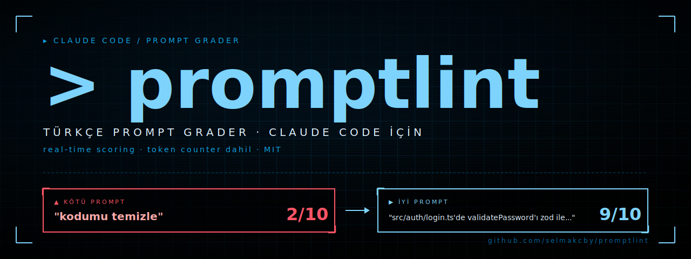

<p align="center">
  
</p>

<p align="center">
  <code>real-time prompt scoring</code> ·
  <code>token counter dahil</code> ·
  <code>Claude Code hook</code> ·
  <code>Türkçe</code>
</p>

---

# promptlint

> **Claude Code için real-time prompt kalite kontrolü.** Kötü prompt yazınca uyarır, iyi promptu sessizce geçirir, token sayacıyla maliyetini kanıtlar.

---

## Ne yapar

Sen Claude Code'da promptu yazıp ENTER'a basınca, `promptlint` araya girer:

```
SEN: kodumu temizle
↓
[promptlint hook] analiz...
↓
🚨 PROMPTLINT — Skor: 2/10

Sorunlar:
  • Belirsiz fiil — hangi dosya, hangi pattern, hangi standart?
  • Spesifik referans yok — dosya, fonksiyon, satır numarası ekle
  • Kapsam belirsiz — neye DOKUNMASIN?

Önerilen format:
  → DOSYA / KAPSAM   (src/auth/login.ts:42-78)
  → AKSIYON          (validatePassword'ı zod schema ile refactor et)
  → SINIRLAR         (test dosyalarına dokunma)
  → ÇIKTI            (sadece değişen satırları göster)

Promptu yeniden yaz, devam edeceğim.
```

Skor sistemine göre 3 davranış:

| Skor | Davranış |
|------|----------|
| 7-10 | Silent pass — promptlint sessizdir |
| 4-6  | Pass + Claude'a coach notu (sana sormadan netleştirir) |
| 0-3  | BLOK — kullanıcıya geri döner, yeniden yazdırır |

Yanında **token-counter** geliyor: her mesajın canlı maliyetini ekrana basar. Promptun iyi mi kötü mü olduğunu **sayılarla kanıtlar**.

---

## Kurulum

```bash
git clone https://github.com/selmakcby/promptlint.git
cd promptlint
./install.sh
```

`install.sh`:
1. Hook'u `~/.claude/hooks/` altına kopyalar
2. Skill'i `~/.claude/skills/prompt-coach/` altına kopyalar
3. Token counter'ı `~/bin/` altına kopyalar
4. Sana `~/.claude/settings.json`'a eklemen gereken JSON'u verir

**Manuel adım** — `~/.claude/settings.json`'a ekle (root level'a `hooks` anahtarı altına):

```json
{
  "hooks": {
    "UserPromptSubmit": [
      {
        "hooks": [
          {
            "type": "command",
            "command": "python3 ~/.claude/hooks/prompt-checker.py"
          }
        ]
      }
    ]
  }
}
```

---

## Test

```bash
claude
> kodumu temizle
```

Hook devreye girer, skor verir, blok atar. Skor düşükse Claude komutunu çalıştırmaz, sana geri döner.

İyi prompt için:
```bash
claude
> src/auth/login.ts dosyasındaki validatePassword fonksiyonunu zod ile refactor et. Test dosyalarına dokunma.
```

Hook sessizce geçirir, Claude normal şekilde çalışır.

---

## Token counter

```bash
python3 ~/bin/token-counter.py            # mevcut session'ı izle
python3 ~/bin/token-counter.py --new      # sadece script sonrası başlayan session'ı izle (video için)
```

Canlı dashboard:
- Context window dolulu (% kaç)
- Session toplamları (input / output / cache write / cache read)
- Tahmini maliyet (Opus / Sonnet / Haiku auto-detect)
- Live spinner — son cevaba göre güncelleme

---

## Özelleştirme

`prompt-checker.py` dosyasının üst kısmında:

```python
PASS_THRESHOLD  = 7   # >= → silent pass
BLOCK_THRESHOLD = 4   # <  → block

VAGUE_VERBS    = [...]   # belirsiz fiil listesi
REFERENCE_PATTERNS = [...] # dosya/fonksiyon regex'leri
SCOPE_KEYWORDS = [...]   # "dokunma", "sadece", vb.
FORMAT_KEYWORDS = [...]  # "tablo", "liste", vb.
```

Kuralları kendi diline / projene göre düzenleyebilirsin.

---

## Skor formülü

| Boyut | Etki |
|-------|------|
| Uzunluk < 15 char | -5 |
| Uzunluk 15-40 char | -2 |
| Belirsiz fiil var | -3 |
| Spesifik referans yok | -2 |
| Kapsam (dokunma/sadece) yok | -1 |
| Format (tablo/liste) yok | -1 |

Başlangıç skoru: 10. Conversation continuation kelimeleri (`evet`, `tamam`, `devam`, vs.) silent pass.

---

## Klasör yapısı

```
promptlint/
├── install.sh                              # tek komut kurar
├── README.md                               # bu dosya
├── LICENSE                                 # MIT
├── .claude/
│   ├── settings.example.json               # hook config
│   ├── hooks/
│   │   └── prompt-checker.py               # ANA BEYİN
│   └── skills/
│       └── prompt-coach/
│           └── SKILL.md                    # Claude bunu okur
├── tools/
│   └── token-counter.py                    # canlı sayaç
└── examples/
    ├── 01-developer-prompts.md             # kötü/iyi pairs
    ├── 02-daily-prompts.md                 # günlük örnekler
    └── 03-formula.md                       # formül & template
```

---

## Felsefe

Prompt yazmak bir **beceri**. Diğer beceriler gibi geri-bildirimle gelişir.
`promptlint` sana **anlık** geri-bildirim verir; her prompttan öğrenirsin.

Token counter ise iddiayı kanıta çevirir:
> "İyi prompt yaz" → boş laf
> "İyi prompt yaz, bak ölçüyorum" → kanıt

---

## Lisans

MIT — bkz. `LICENSE`.

---

## Katkı

Issue aç, PR gönder, fork at. Vague prompt regex'lerine yenilerini eklemek özellikle değerli — kendi dilindeki "lazy verb" kalıplarını PR olarak gönder.
